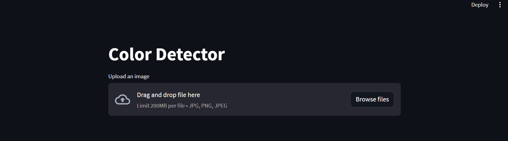

# Color Detector Web App

This is a Streamlit web application that allows users to upload an image and detect its dominant colors.

## Installation

To run this application locally, follow these steps:

1. Clone the repository:

   ```bash
   git clone https://github.com/harshbafnaa/color-detector-app.git
   cd color-detector-app
   ```

2. Install the required Python packages listed in `requirements.txt`:

   ```bash
   pip install -r requirements.txt
   ```

3. Run the Streamlit app:

   ```bash
   streamlit run app.py
   ```

4. Open your web browser and navigate to the URL provided by Streamlit (usually http://localhost:8501) to access the application.

## Usage

1. Click the "Upload an image" button to select and upload an image.

2. Adjust the slider to select the number of dominant colors you want to detect.

3. The application will display the uploaded image, dominant colors as swatches, and their respective hex codes.

4. To pick a color from the image, click on the image, and then click the "Get Color" button to display the hex code of the selected color.

## Screenshots



## Contributing

Contributions are welcome! If you'd like to enhance or fix issues in the application, please fork this repository, make your changes, and submit a pull request.

## License

This project is licensed under the MIT License.

## Acknowledgments

- This application uses the Streamlit library for creating web apps.
- Color detection is based on K-means clustering.
- Color naming is done using the webcolors library.

## Credits
This project was created by [Harsh Bafna](https://github.com/harshbafnaa)